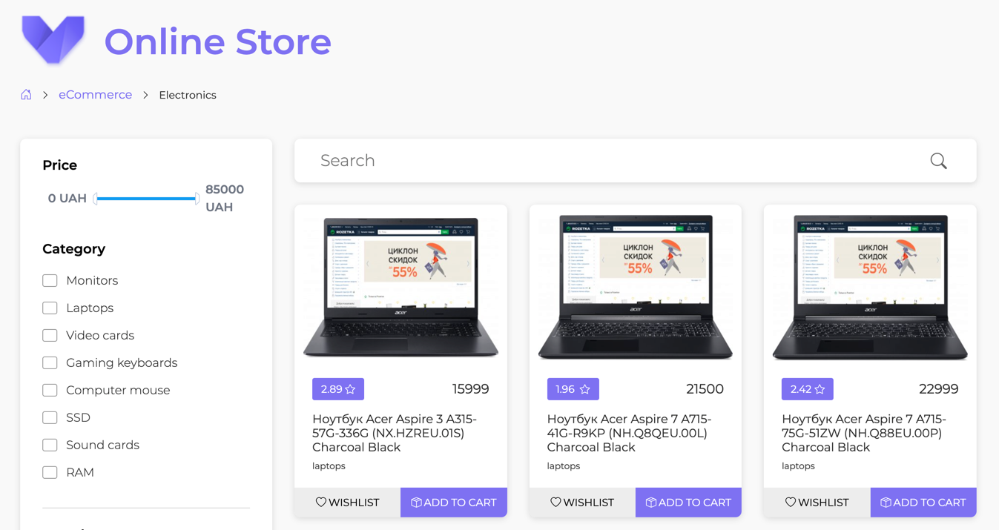

# JavaScript module



## To start project:

To start project, please run the next commands:

* `npm install` - install dependencies

**Note:** You must have installed Nodejs and Npm on your local machine  
To check versions of Nodejs and Npm please run in terminal: `node -v` и `npm -v`  
Required versions:
```
  "engines": {
    "node": ">=14.0.0",
    "npm": ">=6.0.0"
  }
```

* `npm run start:backend` - start backend server

```
  Resources
  http://localhost:3000/products
  http://localhost:3000/categories
  http://localhost:3000/brands

  Home
  http://localhost:3000

```

* `npm run start:client` - start client server and serv files at: http://localhost:9080

